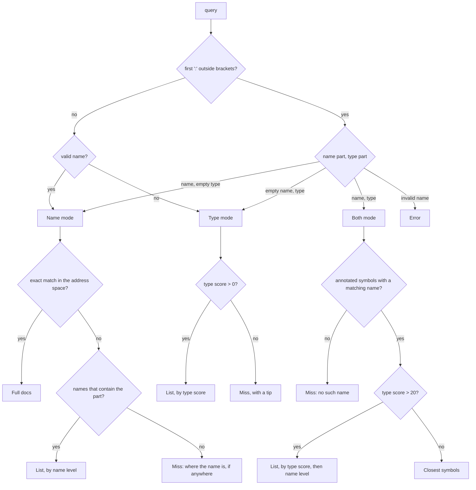

# Symbol search

`search_symbols` finds a symbol by its name, by its type, or by both. This
page gives every rule that the tool applies, from the parse of the query to
the order of the list in a failed search. The code states each rule as a
comment at the step that applies it. This page collects all the rules in one
place.

| Step | Code |
|---|---|
| Parse the query | `parseSymbolQuery`, `namePattern` in `src/symbol_query.ts:42,67` |
| Match a name | `nameQuality` in `src/symbol_query.ts:86` |
| Match and score a type | `normalizeTypeSig`, `scoreItem`, `searchBySig` in `src/sig_search.ts:33,210,257` |
| Break ties | `compareMatches`, `compareItems` in `src/sig_search.ts:151,161` |
| Build the reply | `searchByName`, `searchByType`, `searchByNameAndType` in `src/server.ts:1358,1452,1487` |

## Terms

| Term | Meaning |
|---|---|
| Symbol | A type or a value in an index, such as `Str.concat` or `Try`. The code calls it an item |
| Name part, type part | The text before and after the first top-level `:` of a query |
| Name mode, Type mode, Both mode | The three ways to read a query. Section 1 gives the rule that selects one |
| Name level | How well a symbol's name matches the name part, from 3 to -1. Section 3 |
| Type score | How well a symbol's signature matches the type part, from 100 to 0. Section 4 |
| Exact match | In Name mode, a symbol that the query names in full. Section 6 lists the forms |
| Miss | A reply with no match |
| Active platform | The platform that `scope` names, else the platform that the app header imports |
| Entry | One symbol in a list reply |

## Overview



## 1. Parse

The parser splits the query at its first `:` at bracket depth 0. The `:` of a
record field (`{ x : F32 }`) or of a `where` clause (`where [a.f : ..]`) is
inside brackets, so it never splits a query.

A name is an identifier or a dotted path. It can contain `!`, and it can end
in `.`. The grammar is `^[A-Za-z_][\w!]*(\.[A-Za-z_][\w!]*)*\.?$`.

| Query | Colon | Name part | Type part | Mode |
|---|---|---|---|---|
| `Str.concat`, `Try`, `read_utf8!` | no | the query | | Name |
| `-> F32`, `List(a), (a -> b) -> List(b)`, `{ x : F32 } -> Str` | no | | the query | Type, because the query is not a valid name |
| `: Str` | yes | empty | `Str` | Type |
| `ceil :` | yes | `ceil` | empty | Name |
| `ceil : -> F32`, `F32.ceil : F32 ->`, `Path. : => Bool` | yes | a valid name | not empty | Both |
| `foo bar : Str` | yes | not a valid name | | Error. The reply gives the grammar |
| Empty, or `:` alone | | | | Error: "Empty query." |

One word is always a name. To search by a type of one word, write `: Str`. A
single lowercase word is a type variable, and a type query of one variable
matches nothing. So the rule loses no useful type query.

In Both mode, `namePattern` splits the name part into a module filter and a
part:

| Name part | Module filter | Part |
|---|---|---|
| `ceil` | none | `ceil` |
| `F32.ceil` | `F32` | `ceil` |
| `F32`, `Num.F32` | the whole name part, because the last segment starts with an uppercase letter | none |
| `Path.` | `Path`, because the name part ends in `.` | none |

In Name mode, the list of partial names splits the query at its last `.`, and
an uppercase last segment does not make a module filter. So `Foo` is a part
there, not a module.

## 2. Corpora and `scope`

| Search | Without `scope` | With `scope` |
|---|---|---|
| Exact match | The address space: the language, the builtins with the packages that the app pins, and the active platform (`getMergedIndex`, `src/scopes.ts:1700`) | The same. If `scope` names a platform, that platform is the active platform |
| A list: partial names, a type, or both | The working set: every corpus that is not a platform, and the active platform (`resolveScopes`) | Only the corpus that `scope` names |

An exact match uses the whole address space, so a caller who has a name never
gets a miss because of a wrong corpus guess. A list uses only the `scope`
corpus, because a narrow search is how a caller finds a platform function
among the 193 builtins that return `Bool`.

| Mode | Kind | Tier | Annotation |
|---|---|---|---|
| Name, exact match and list | types and values | public and host | any |
| Type and Both | values | public | annotated only. The lambda head of an unannotated value is not a type |

## 3. Name matching

`nameQuality(item, pattern)` gives each symbol a name level. The match ignores
case. If the pattern has a module filter, the symbol's module path must equal
the filter or end in `.` and the filter. So `F32` matches `Num.F32`, and does
not match `Num.F32X`.

| Name level | Rule | `ceil` matches |
|---|---|---|
| 3 | the whole name | `ceil` |
| 2 | the start of the name | `ceiling` |
| 1 | the start of a word after `_` | `div_ceil_by` |
| 0 | any other position, or any name when the pattern has no part | `preceil` |
| -1 | no match. The search drops the symbol | `floor` |

In every mode, a symbol must have a name level of 0 or more. In a list of
partial names, the name level also sets the order.

## 4. Type matching and scores

`normalizeTypeSig` prepares two types for comparison:

1. It joins the lines into one and removes a `where` clause.
2. It removes the `..` of an open union or record. So `[OutOfRange]` asks the
   same question as `[OutOfRange, ..]`.
3. It renames the type variables to `a`, `b`, and so on, in the order of first
   appearance. So `List x -> x` and `List a -> a` are equal.

A type variable in the query matches any one type in the signature. The rule
works in one direction only, so a variable in the signature does not match a
concrete type in the query. One variable matches one type, so `List a -> a`
does not match `List Str -> U64`. A match attempt fails after 5000 steps. Real
queries need tens of steps.

The arrows at the ends of the type part select what the search compares. For
each query form, the search tries the rows from top to bottom, and the first
row that matches sets the type score.

| Query form | Compares | Literal match | Match through a type variable |
|---|---|---|---|
| `A -> B` | the whole signature | 100 `exact` | 95 `exact_unified` |
| `-> B` | the return type | 90 `return_type` | 85 `return_type_unified` |
| `-> B` | the text of the signature | 10 `substring` | |
| `A ->` | the argument list | 70 `exact_args` | 65 `exact_args_unified` |
| `A ->` | the start of the argument list | 50 `args_prefix` | |
| `B`, no arrow | the return type | 80 `return_type` | 75 `return_type_unified` |
| `B` | the argument list | 60 `args` | 55 `args_unified` |
| `B` | the start of the argument list | 50 `args_prefix` | |
| `B` | the text of the signature | 20 `substring` | |

`=>` has the same effect as `->`. A type score of 0 is no match.

`SUBSTRING_SCORE` (20) is the highest score of a `substring` match. Such a
match only contains the type part as text. For example, `-> F32` matches
`ceiling_to_i32_try : F32 -> Try(I32, [OutOfRange])` at 10, but that function
does not return `F32`.

## 5. Order

| List | Key 1 | Key 2 | Key 3 | Key 4 | Key 5 |
|---|---|---|---|---|---|
| Partial names, Name mode | name level | documented first | fewer `.` in the full name | full name, A to Z | |
| Type mode | type score | documented first | fewer `.` in the full name | full name, A to Z | |
| Both mode | type score | name level | documented first | fewer `.` in the full name | full name, A to Z |

The search compares two symbols by key 1. Only if they are equal does it
compare them by key 2, and so on. The search never adds two scores together.
So each mode has one ranking, and Both mode uses the name level only to break
a tie. For example, `floor : -> Dec` matches `Num.Dec.floor` and
`Num.Dec.div_floor_by`, both at 90. The name level 3 of `floor` puts
`Num.Dec.floor` first, but `div_floor_by` comes first from A to Z.

The last keys are necessary because ties are frequent. `-> Bool` matches 193
signatures at 90. Without these keys, undocumented helpers in `Encoding.Json`
fill the first 10 entries.

## 6. Replies

`limit` (default 10) sets the maximum number of entries in a list. An exact
match does not make a list, so the reply shows all exact matches. When a list
has more entries than `limit`, its last line is "Showing 10 of N." and a next
step.

| Mode | Result | Reply |
|---|---|---|
| Name | Exact match: the full name, the two symbols of a name that two namespaces declare, a suffix (`U64.from_str` finds `Num.U64.from_str`), or all symbols with the bare name | Each symbol with its full docs. A note when two namespaces declare the name, when the symbol is the host ABI boundary, or when the name is also a module |
| Name | No exact match. Some names contain the part | "Nothing is named `X`. N names contain `x`:" and a list. The next step is to add a type |
| Name | No exact match. The query ends in `.` | "Nothing is named `X`. N symbols are in `M`:" and a list |
| Name | No match | The out-of-scope note, else "Nothing matched". Then the unpinned-package note |
| Type | Matches | A list. Each entry shows its match kind and type score |
| Type | No match | "No matches for `T` in scope=…", and a tip: the names of type variables have no effect, and the order of arguments does |
| Both | No annotated symbol has a matching name | "No annotated symbol in scope=… has a name that matches `X`." Then the unpinned-package note |
| Both | Type scores above 20 | A list. Each entry shows its match kind and type score. The next step is to narrow the name |
| Both | Matching names, but no type score above 20 | The failed search, below |

An entry shows the full name, the origin, the complete signature, and the
first line of the docs. The entry shows the complete signature because a
`where` clause on a later line changes what the symbol accepts.

### The failed search in Both mode

The reply states that nothing matches, and then lists the closest symbols:

```
No symbol similar to `ceil` matches `-> F32`. 52 symbols have a different type. Closest matches:
```

The order of the list:

1. The symbols with a type score from 1 to 20. Their signatures contain the
   type part only as text. They are in the Both mode order of section 5.
2. The other symbols with a matching name, in name level order, then in the
   last three keys of section 5.

So for `ceil : -> F32`, `Num.F32.ceiling_to_i128_try : F32 -> Try(I128, ..)`
comes before `Num.Dec.ceiling : Dec -> Dec`. Neither returns `F32`, but the
first signature contains `F32`. The list shows no type score for these
entries, because a substring match does not answer the query.

## 7. Footers

A Type or Both reply ends with a footer, "N matches in scope=…". The footer
can also name other scopes that have matches, so the caller can search again
with `scope`. A Name reply has no footer, because its miss reply can name the
platforms that have the name.

The `elsewhere` function (`src/elsewhere.ts`) selects the scopes that a reply
can name. Its `reach` has two values:

| `reach` | Scopes | Reason |
|---|---|---|
| `pinned` | Corpora that are not platforms, and the active platform | A reply that has an answer must not send the caller to a platform that the app cannot compile against |
| `anywhere` | All corpora and all platforms | A miss can say that the name exists in a platform that this app does not pin |

| Reply | `reach` | Count in each scope |
|---|---|---|
| Type, any result | `pinned` | the type matches, up to 1000 |
| Both, matches or the failed search | `pinned` | the matches with a type score above 20 |
| Both, no matching name | `anywhere` | the annotated symbols with a matching name |
| Name, no match | `anywhere`, in the out-of-scope note, which names platforms only | the exact matches |

A miss also names a documented package that has the name, if the app does
not pin that package. The note shows the header line that pins it.
