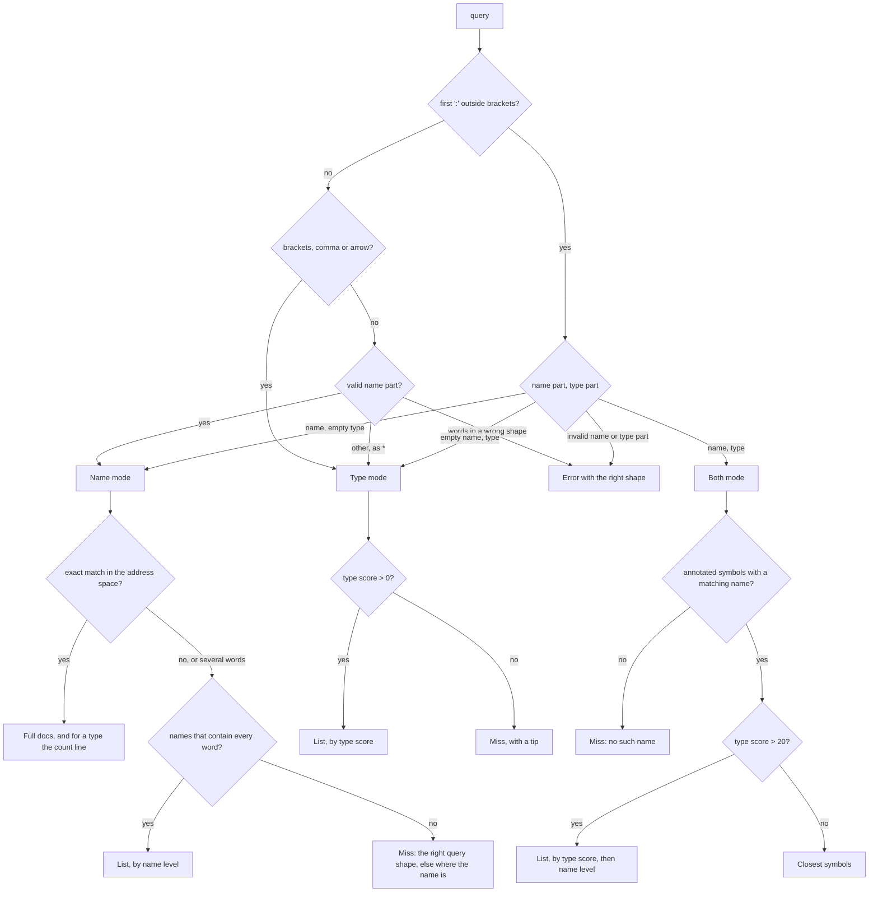

# Symbol search

`search_symbols` finds a symbol by its name, by its type, or by both. This
page gives every rule that the tool applies, from the parse of the query to
the order of the list in a failed search. `search_project_symbols` applies the
same rules to the `.roc` files of a project, and section 8 gives the
differences. The code states each rule as a comment at the step that applies
it. This page collects all the rules in one place.

| Step | Code |
|---|---|
| Parse the query | `readName`, `typeError`, `parseSymbolQuery`, `namePattern` in `src/symbol_query.ts:55,74,89,123` |
| Match a name | `nameQuality`, `nameRank` in `src/symbol_query.ts:152,172` |
| Qualify the type names of a signature | `qualifyTypeNames`, `qualifySignatures` in `src/sig_search.ts:87,101` |
| Match and score a type | `normalizeTypeSig`, `sameToken`, `scoreItem`, `searchBySig` in `src/sig_search.ts:36,122,278,325` |
| Break ties | `compareMatches`, `compareItems` in `src/sig_search.ts:219,229` |
| Answer a list of queries | `QUERY_LIST`, `joinReplies` in `src/server.ts:1748,1754` |
| Build a list, for both tools | `nameList`, `nameAndType` in `src/server.ts:1344,1463` |
| Count line, miss replies | `countLine`, `shapeHint` in `src/server.ts:1388,1418` |
| Build the reply, bundled indexes | `searchByName`, `searchWords`, `searchByType`, `searchByNameAndType` in `src/server.ts:1558,1662,1683,1710` |
| Build the reply, project files | `exactIn`, `searchProject` in `src/server.ts:2620,2637` |
| Send a bundled miss to the project | `projectModuleNote`, `ProjectProbe` in `src/server.ts:1511,1527` |

## Terms

| Term | Meaning |
|---|---|
| Symbol | A type or a value in an index, such as `Str.concat` or `Try`. The code calls it an item |
| Name part, type part | The text before and after the first top-level `:` of a query |
| Word | One of the space-separated pieces of a name part, as `try` and `ceil` in `F32.try ceil`. Each word must occur in the symbol's name |
| Module filter | A module that the name part names, as `F32` in `F32.try ceil`. Section 3 |
| Name mode, Type mode, Both mode | The three ways to read a query. Section 1 gives the rule that selects one |
| Name level | How well a symbol's name matches the words of the name part, from 3 to -1. Section 3 |
| Type score | How well a symbol's signature matches the type part, from 100 to 0. Section 4 |
| Exact match | In Name mode, a symbol that the query names in full. Section 6 lists the forms |
| Miss | A reply with no match |
| Active platform | The platform that `scope` names, else the platform that the app header imports |
| Entry | One symbol in a list reply |

## Overview



## 1. Parse

The parser splits the query at its first `:` at bracket depth 0. The `:` of a
record field (`{ x : F32 }`) or of a `where` clause (`where [a.f : ..]`) is
inside brackets, so it never splits a query.

### The name part

A name part is a first token, then zero or more words, separated by spaces:

| Piece | Grammar | Examples |
|---|---|---|
| First token | An identifier or a dotted path. It can contain `!`, and it can end in `.`. `^[A-Za-z_][\w!]*(\.[A-Za-z_][\w!]*)*\.?$` | `ceil`, `Str.concat`, `F32.try`, `Path.`, `Try` |
| Each later word | Starts with a lowercase letter or `_`, has no `.`, and has `!` only at its end. `_` alone is not a word | `ceil`, `utf8!`, `i64` |

A space after a first token that ends in `.` joins the two tokens. So
`F32. try ceil` is `F32.try ceil`.

### No colon

Without a `:`, these rules apply in order. The first rule that matches sets the
mode:

| # | Query | Mode |
|---|---|---|
| 1 | Has `(`, `)`, `[`, `]`, `{`, `}`, `,`, `->`, `=>` or `..` | Type |
| 2 | A valid name part: `Str.concat`, `Try`, `size window`, `F32.try ceil` | Name |
| 3 | Words in a wrong shape: `F32 try ceil`, `List a`, `ceil F32` | Error (table below) |
| 4 | Anything else, such as `*` | Type |

### With a colon

| Query | Name part | Type part | Mode |
|---|---|---|---|
| `: Str` | empty | `Str` | Type |
| `ceil :`, `F32.try ceil :` | valid | empty | Name |
| `ceil : -> F32`, `F32.ceil : F32 ->`, `Path. : => Bool`, `size window : -> F32` | valid | valid | Both |
| `ceil F32 : Str` | not valid | | Error (table below) |
| Empty, or `:` alone | | | Error: "Empty query." |

### Why words never collide with a type

In this Roc, two identifiers that only a space separates are never a valid
type. Type arguments are in parentheses: `List(a)`, never `List a`. The one
exception is the keyword `where`. A scan of all 4627 value signatures in the
bundled indexes and the plugins found no such pair outside a `where` clause.
So a sequence of words is always a name.

The same fact makes a space between two identifiers in a type part an error.
Such a type is usually old Roc syntax that a caller recalls, and as a type it
matches nothing.

### Errors

| Query | Problem | Reply |
|---|---|---|
| `F32 try ceil`, `Str concat`, `List a` | A capitalized first token without a `.`, then words. It could be a module filter or an old-style type | "Join a module to the name with a dot, as in `F32.try ceil`. Write type arguments in parentheses, as in `: List(a)`." |
| `ceil F32`, `try Ceil` | A capitalized word after the first token. Only the first token can name a module | The same reply |
| `: size window` | A type part of lowercase words only. As a type, it has only type variables, which match nearly anything | "`size window` is not a type. To search names, put the words before the colon: `size window :`." |
| `: List a`, `List a -> a` | A type part with a space between two identifiers, outside a `where` clause | "Write type arguments in parentheses: `List(a)`." |

One capitalized name has a name reading and a type reading. `Str` is a type
and a module, and `: Str` lists the functions that return it. The name reading
wins, and the reply adds a count of the type reading (section 6). As a type,
one lowercase word is a type variable, and a type query of one variable matches
nothing. So the name reading loses no useful type query.

### The module filter and the words

`namePattern` splits a name part into a module filter and words:

| Name part | Module filter | Words |
|---|---|---|
| `ceil` | none | `ceil` |
| `F32.ceil` | `F32` | `ceil` |
| `F32.try ceil` | `F32` | `try`, `ceil` |
| `size window` | none | `size`, `window` |
| `F32`, `Num.F32` | the whole name part, because the last segment starts with an uppercase letter | none |
| `Path.` | `Path`, because the name part ends in `.` | none |

In Name mode with one name, the list of partial names splits the query at its
last `.`, and an uppercase last segment does not make a module filter. So
`Foo` is a word there, not a module.

## 2. Corpora and `scope`

| Search | Without `scope` | With `scope` |
|---|---|---|
| Exact match | The address space: the language, the builtins with the packages that the app pins, and the active platform (`getMergedIndex`, `src/scopes.ts:1700`) | The same. If `scope` names a platform, that platform is the active platform |
| A list: partial names, a type, or both | The working set: every corpus that is not a platform, and the active platform (`resolveScopes`) | Only the corpus that `scope` names |

An exact match uses the whole address space, so a caller who has a name never
gets a miss because of a wrong corpus guess. A list uses only the `scope`
corpus, because a narrow search is how a caller finds a platform function
among the 193 builtins that return `Bool`.

| Mode | Kind | Tier | Annotation |
|---|---|---|---|
| Name, exact match and list | types and values | public and host | any |
| Type and Both | values | public | annotated only. The lambda head of an unannotated value is not a type |

## 3. Name matching

`nameQuality(item, pattern)` gives each symbol a name level. The match uses
case, because in Roc case separates a type from a value. So `snapshot` does not
match the type `Snapshot`, and `Snap` does. If the pattern has a module filter,
the symbol's module path must equal the filter or end in `.` and the filter. So
`F32` matches `Num.F32`, and does not match `Num.F32X`.

Each word gets a level from the table below. The symbol's name level is the
lowest level of its words, so every word must match. For example,
`size window` on `window_size_try` gives `window` level 2 and `size` level 1, so
the name level is 1.

| Level of a word | Rule | `ceil` matches |
|---|---|---|
| 3 | the whole name. Only one word can reach this level | `ceil` |
| 2 | the start of the name | `ceiling` |
| 1 | the start of a word after `_` | `div_ceil_by` |
| 0 | any other position, or any name when the pattern has no part | `preceil` |
| -1 | no match. The search drops the symbol | `floor` |

In every mode, a symbol must have a name level of 0 or more. In a list of
partial names, the name level also sets the order. Two words can match the
same letters, as `ceil ceiling` on `ceiling`. The match accepts this, because
it does no harm.

## 4. Type matching and scores

`normalizeTypeSig` prepares two types for comparison:

1. It joins the lines into one and removes a `where` clause.
2. It removes the `..` of an open union or record. So `[OutOfRange]` asks the
   same question as `[OutOfRange, ..]`.
3. It renames the type variables to `a`, `b`, and so on, in the order of first
   appearance. So `List x -> x` and `List a -> a` are equal.

A type variable in the query matches any one type in the signature. The rule
works in one direction only, so a variable in the signature does not match a
concrete type in the query. One variable matches one type, so `List a -> a`
does not match `List Str -> U64`. A match attempt fails after 5000 steps. Real
queries need tens of steps.

The arrows at the ends of the type part select what the search compares. For
each query form, the search tries the rows from top to bottom, and the first
row that matches sets the type score.

| Query form | Compares | Literal match | Match through a type variable |
|---|---|---|---|
| `A -> B` | the whole signature | 100 `exact` | 95 `exact_unified` |
| `-> B` | the return type | 90 `return_type` | 85 `return_type_unified` |
| `-> B` | any part of the signature | 10 `substring` | |
| `A ->` | the argument list | 70 `exact_args` | 65 `exact_args_unified` |
| `A ->` | the start of the argument list | 50 `args_prefix` | |
| `B`, no arrow | the return type | 80 `return_type` | 75 `return_type_unified` |
| `B` | the argument list | 60 `args` | 55 `args_unified` |
| `B` | the start of the argument list | 50 `args_prefix` | |
| `B` | any part of the signature | 20 `substring` | |

`=>` has the same effect as `->`. A type score of 0 is no match.

A module writes its own types without the module: `Draw.text!` takes a
`Frame`, and `Text.draw_prepared!` takes a `Draw.Frame`. So when a corpus
loads, `qualifySignatures` writes each type name in a signature as the full
name of the type that it refers to. These rules apply:

1. The innermost module that declares the name wins. In
   `Crypto.SHA256.Hasher`, `Hasher` is that type. In `Str`, `Hasher` is the
   top-level type.
2. A name that no module of the corpus declares stays as written, for example
   a type from a package, or a type that an `import` exposes.
3. A tag stays as written, because a tag and a type can have the same name.
4. The reply shows the signature as the source writes it.

A project is one corpus, so the rules read the types of all its files.

The match compares the type part and the signature token by token. A type
name in the query matches the same name, or a full name that ends with a `.`
and the query name. So `Frame ->` and `Draw.Frame ->` both find the 24
functions that take a `Draw.Frame`. `Str.Utf8Problem ->` finds
`Str.Utf8Problem.is_eq`, which writes `Utf8Problem`. A partial token does not
match: `Str ->` does not match `Stream.map`, and `U64` does not match
`U64x2`.

`SUBSTRING_SCORE` (20) is the highest score of a `substring` match. Such a
match only contains the type part somewhere in the signature. For example, `-> F32` matches
`ceiling_to_i32_try : F32 -> Try(I32, [OutOfRange])` at 10, but that function
does not return `F32`.

## 5. Order

| List | Key 1 | Key 2 | Key 3 | Key 4 | Key 5 | Key 6 |
|---|---|---|---|---|---|---|
| Partial names, Name mode | name level | words in query order | documented first | fewer `.` in the full name | full name, A to Z | |
| Type mode | type score | documented first | fewer `.` in the full name | full name, A to Z | | |
| Both mode | type score | name level | words in query order | documented first | fewer `.` in the full name | full name, A to Z |

"Words in query order" puts a name whose words appear in the order of the
query first. So `ceil try` puts `ceil_try` before `try_ceil`. With one word,
this key is always equal.

The search compares two symbols by key 1. Only if they are equal does it
compare them by key 2, and so on. The search never adds two scores together.
So each mode has one ranking, and Both mode uses the name level only to break
a tie. For example, `floor : -> Dec` matches `Num.Dec.floor` and
`Num.Dec.div_floor_by`, both at 90. The name level 3 of `floor` puts
`Num.Dec.floor` first, but `div_floor_by` comes first from A to Z.

The last keys are necessary because ties are frequent. `-> Bool` matches 193
signatures at 90. Without these keys, undocumented helpers in `Encoding.Json`
fill the first 10 entries.

## 6. Replies

`query` is a list of up to 8 queries, and a lone string is one query. Each
query gets its own reply, as if it were the only one. With several queries,
each reply is under a heading `` # `<query>` ``, in the order sent. An invalid
query gives an error in its own section, and the other queries still answer.
The notes about the session, such as the detection note, come once, after the
last section. The scope footer of a query stays in its section, because its
counts are for that query.

`limit` sets the maximum number of entries in each list. The default is 10 for
one query and 5 for several queries, so 8 queries return at most 40 entries.
An exact match does not make a list, so the reply shows all exact matches. When
a list has more entries than `limit`, its last line is "Showing 10 of N." and a
next step.

| Mode | Result | Reply |
|---|---|---|
| Name | One name with an exact match: the full name, the two symbols of a name that two namespaces declare, a suffix (`U64.from_str` finds `Num.U64.from_str`), or all symbols with the bare name | Each symbol with its full docs. A note when two namespaces declare the name, when the symbol is the host ABI boundary, or when the name is also a module. For a type, the count line below |
| Name | One name, no exact match. Some names contain the word | "Nothing is named `X`. N names contain `x`:" and a list. The next step is to add a type |
| Name | Several words. Some names contain all of them | "N names contain `try` and `ceil` in `F32`:" and a list. Several words have no exact match |
| Name | Several words, no match | "No name contains `try` and `ceil` in `F32`." Then the unpinned-package note |
| Name | The query ends in `.` | "N symbols are in `M`:" and a list. The caller asked for the contents of the module, so the reply does not call it a miss |
| Name | No match | A miss reply below that names the right query shape, if one applies. Else the out-of-scope note, else "Nothing matched". Then the unpinned-package note |
| Type | Matches | A list. Each entry shows its match kind and type score |
| Type | No match | "No matches for `T` in scope=…", and a tip: the names of type variables have no effect, and the order of arguments does |
| Both | No annotated symbol has a matching name | "No annotated symbol in scope=… has a name that matches `X`." Then the unpinned-package note |
| Both | Type scores above 20 | A list. Each entry shows its match kind and type score. The next step is to narrow the name |
| Both | Matching names, but no type score above 20 | The failed search, below |

An entry shows the full name, the origin, the complete signature, and the
first line of the docs. The entry shows the complete signature because a
`where` clause on a later line changes what the symbol accepts.

### The count line

An exact match on a type ends with the count of its type reading:

```
24 functions take a `Frame` (`Frame ->`).
```

Each half shows only when its count is not zero, and the line shows only when
one half does. The count tells the caller if the call is worth making, which a
fixed hint cannot do. It also shows the query that finds the functions of a
type, which are its methods. The two type searches cost about 10 ms.

### Miss replies that teach the query shape

A miss usually means that the caller shaped the query wrongly. The reply names
the right shape, at the moment that the caller needs it:

| Query | Cause | Reply |
|---|---|---|
| `Frame.text!`, when `Frame` is a type and no name matches | A method is declared in its module, not on the type of its receiver | "`Frame` is a type in `Draw`. Its functions are in their module, so search `text!`, or `Frame ->` for the functions that take a `Frame`." |
| `Keys`, when `Keys` is a module and not a symbol | A module is not a symbol | "`Keys` is a module. `Keys.` lists its N symbols." For a bundled module, the reply names `get_roc_module("Keys")`, which gives the module page. For a project module, the reply names its file (section 8). This reply comes before the list of names that contain the word |
| `Space`, a capitalized name with no match | A tag is part of a union type, and the index has no tags | "No symbol is named `Space`. `KeySpace` is a tag in `Keys.Key`." With several tags: "Tags that contain it:" and up to 3. The search reads the bodies of public types only, and only after such a miss |

### The failed search in Both mode

The reply states that nothing matches, and then lists the closest symbols:

```
No symbol similar to `ceil` matches `-> F32`. 52 symbols have a different type. Closest matches:
```

The order of the list:

1. The symbols with a type score from 1 to 20. Their signatures contain the
   type part, but not as the return type or the arguments. They are in the Both mode order of section 5.
2. The other symbols with a matching name, in name level order, then in the
   last three keys of section 5.

So for `ceil : -> F32`, `Num.F32.ceiling_to_i128_try : F32 -> Try(I128, ..)`
comes before `Num.Dec.ceiling : Dec -> Dec`. Neither returns `F32`, but the
first signature contains `F32`. The list shows no type score for these
entries, because a substring match does not answer the query.

## 7. Footers

A Type or Both reply ends with a footer, "N matches in scope=…". The footer
can also name other scopes that have matches, so the caller can search again
with `scope`. A Name reply has no footer, because its miss reply can name the
platforms that have the name.

The `elsewhere` function (`src/elsewhere.ts`) selects the scopes that a reply
can name. Its `reach` has two values:

| `reach` | Scopes | Reason |
|---|---|---|
| `pinned` | Corpora that are not platforms, and the active platform | A reply that has an answer must not send the caller to a platform that the app cannot compile against |
| `anywhere` | All corpora and all platforms | A miss can say that the name exists in a platform that this app does not pin |

| Reply | `reach` | Count in each scope |
|---|---|---|
| Type, any result | `pinned` | the type matches, up to 1000 |
| Both, matches or the failed search | `pinned` | the matches with a type score above 20 |
| Both, no matching name | `anywhere` | the annotated symbols with a matching name |
| Name, no match | `anywhere`, in the out-of-scope note, which names platforms only | the exact matches |

A miss also names a documented package that has the name, if the app does
not pin that package. The note shows the header line that pins it.

## 8. Project search

`search_project_symbols` reads the `.roc` files under `root`, or under the
workspace when the call gives no `root`. The parse, the name levels, the type
scores and the order are the same as in sections 1 to 5. These rules differ:

| Rule | Bundled indexes | Project |
|---|---|---|
| Corpus | The address space or the working set (section 2) | All declarations in the project files. A search never mixes the two. `search_symbols` reads the project only for the notes below |
| Symbols | Types and values, by tier | Types and values (`parseRocFile`, `src/roc_parser.ts:48`). An unannotated value has its lambda head as its signature. A Type or Both search reads only the annotated values |
| Exact match | The full name, a collision, a suffix, or the bare name | The full name, else a suffix. A bare name matches the last segment |
| Entry | The origin and the match kind | `file:line`, and `inferred` when a compiler gave the type and the author did not |
| Miss | The footers of section 7 | The miss replies of section 6, then "Nothing in N .roc files under `root` is named `X`.", and a note when `search_symbols` has matches for the query. A module has no page, so the module reply names `Keys.` |
| Footer | Section 7 | None, because the project is one corpus. "Not indexed:" names each source that could not run |

A name that the caller asks for can be a name from the project. So
`get_roc_module` and `search_symbols` also read the workspace index:

| Call | The project has | Reply |
|---|---|---|
| `get_roc_module("Geo")`, no bundled module | A module `Geo` | "`Geo` is a module of this project, in `src/Geo.roc`. Read that file, or call `search_project_symbols` with `Geo.` for its signatures." The file is the whole module, and the index has only what the parser read |
| `get_roc_module("Str")`, a bundled module | A module `Str` | The bundled page, then "The page above is the bundled `Str`." and the reply of the first row |
| `search_symbols("Geo")` or `("Geo.")`, no bundled match | A module `Geo` | The reply of the first row, in place of the miss |
| `search_symbols("helper")`, a name or words miss | N names that match | The miss, then "`search_project_symbols` has N matches for `helper` in this project." |

`search_symbols` reads the workspace index only after a miss, because each read
walks the workspace (`ProjectProbe`, `src/server.ts:1527`). `get_roc_module`
reads it on every call.

`search_project_symbols` exists apart from `search_symbols` because it reads
the disk at each call. Its own name also gives the note on an unknown platform
a direct call to name.

