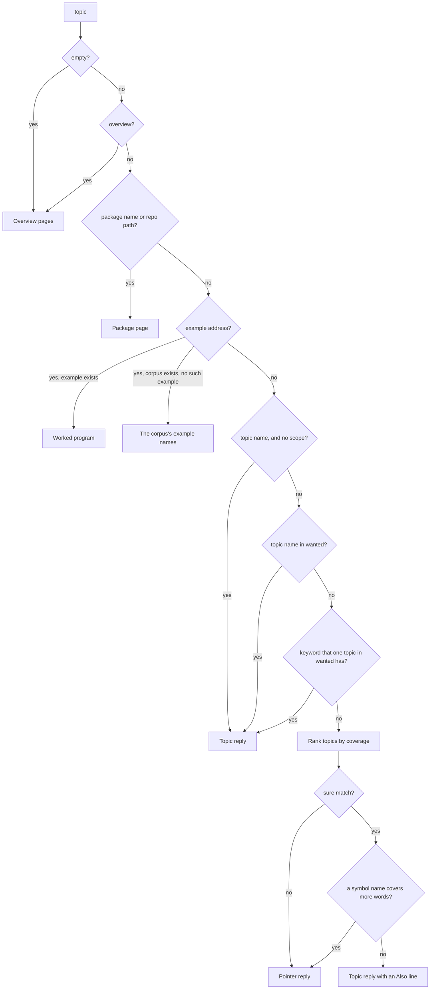

# Syntax lookup

`get_roc_syntax` returns the overview pages, one topic, a package page or a
worked program. Its `topic` argument takes an address or a question in words.
This page gives every rule that the tool applies, from the first check of the
argument to the order of a list of pointers. The code states each rule as a
comment at the step that applies it. This page collects all the rules in one
place.

| Step | Code |
|---|---|
| Select the overview or a topic | the handler of `get_roc_syntax` in `src/server.ts:1163` |
| Return the overview pages | `overviewPage` in `src/server.ts:948` |
| Read an address: a package, an example, a topic name | `syntaxTopic`, `packageNamed`, `exampleNamed` in `src/server.ts:1099,508,2343` |
| Select the scopes of the call | `resolveScopes`, `workingSet` in `src/server.ts:641,617`, `SYNTAX_SCOPES` in `src/server.ts:393` |
| Split a question into words | `words`, `singular`, `STOP_WORDS`, `question` in `src/words.ts:13,23,35,49` |
| Rank the topics, and find a sure match | `matchTopic`, `rankTopics` in `src/topics.ts:579,613` |
| Prefer a symbol to a topic | `askedForSymbol` in `src/server.ts:1057`, `nameCoverage` in `src/words.ts:65` |
| Build a topic reply | `syntaxTopic`, `alsoLine` in `src/server.ts:1099,1006` |
| Build a pointer reply | `pointerReply`, `best`, `mentioned` in `src/server.ts:1016,1090,1066`, `symbolScore` in `src/words.ts:76` |
| List the topics in `tools/list` | `enumeratedTopics` in `src/server.ts:447` |

`search_symbols` uses the same word rules for its docs fallback
(`mentionList`, `src/server.ts:1078`). `docs/design/symbol-search.md` section 6
gives that fallback.

## Terms

| Term | Meaning |
|---|---|
| Address | A `topic` value that names one answer: `overview`, a package name, an example address, or a topic name |
| Topic | A worked program in `corpus/language/topics/`, in a platform corpus or in a plugin, with a description and keywords. `src/topics.ts` declares the topics of this server |
| Keyword | One entry in the `keywords` list of a topic. It can be a phrase, such as `command line` |
| Question | A `topic` value that is not an address |
| Content word | A word of a question that is not a stop word (section 3) |
| Coverage | How many content words of a question a topic covers (section 4) |
| Sure match | A topic that covers clearly more content words than any other topic (section 5) |
| Pointer | One line of a pointer reply. It names a call that reads one topic, one worked program, or one symbol |
| Pointer reply | The reply when a question has no sure match (section 6) |
| Working set | The corpora that a call reads without `scope`: the language, the builtins, and the platform that the app header pins, if any |
| `wanted` | The scopes that one call reads: the `scope` argument, else the working set, in both cases only the scopes that have topics |

## Overview



## Algorithm

The input is the `topic` argument `T` and the `scope` argument `S`. Either can
be absent. The first step that returns a reply ends the algorithm.

1. If `T` is absent or only whitespace, return the overview for `S` (section 1).
2. Let `q` be `T`, trimmed and in lowercase.
3. If `q` is `overview`, return the overview for `S` (section 1).
4. Read the app header of the workspace, once per session. It sets the pinned
   platform and the pinned packages.
5. If `q` is the name or the repo path of a documented package, return the
   package page (section 2, check 2).
6. If `T` has the shape of an example address and its corpus is a scope or a
   package, return the program, or the example names of that corpus when the
   program does not exist (section 2, check 3).
7. Let `wanted` be `[S]` when `S` is set, else the working set. Keep only the
   scopes that have topics.
8. If `S` is absent and `q` is the name of a topic in any corpus, return the
   topic reply for it, with no Also line (section 2, check 4, and section 6).
9. If `q` is the name of a topic in `wanted`, return its topic reply, with no
   Also line (section 2, check 5).
10. If exactly one topic in `wanted` has `q` as a keyword, return its topic
    reply, with no Also line (section 2, check 6).
11. Split `T` into singular words, and mark the content words. Let `n` be the
    count of content words (section 3).
12. Give each topic in `wanted` its coverage of the content words. Drop the
    topics with a coverage of 0. Sort the rest by coverage, highest first, and
    keep declaration order on ties (section 4).
13. Let `top` and `next` be the first two topics of the ranking. A missing
    topic has a coverage of 0. If `top` is missing, or `top` minus `next` is
    less than the margin (1 when `n` is under 5, else 2), go to step 15
    (section 5).
14. If the name or module path of one app-facing symbol covers more content
    words than `top`, go to step 15. Else return the topic reply for `top`,
    with an Also line that names up to 3 of the other ranked topics
    (section 5 and section 6).
15. Return the pointer reply (section 6):
    1. Score the ranked topics, the worked programs of `wanted` and the
       app-facing symbols, all on one scale.
    2. In each list, keep the entries within 1 of the top score, up to 4
       topics, 3 programs and 4 symbols. Then drop each symbol that has no
       content word in its name or module path.
    3. Keep the sections whose top score is within 1 of the best section, best
       section first.
    4. If no section is left, return the miss reply. Else return the head line,
       the sections and the scope footer.

Four traces, with no plugins and no app header, so `wanted` is the language
scope:

| `topic` | Step that answers | Why | Reply |
|---|---|---|---|
| `cli_files` | 8 | a topic name, and the call has no `scope` | the `cli_files` topic, with "A basic-cli topic, which this workspace has not chosen." |
| `while loop` | 14 | `loops` covers 2 of 2 content words, the next topic 0, and no symbol name covers a word | the `loops` topic |
| `pattern match on a list` | 15 | 3 content words. `pattern_matching` and `list_patterns` both cover 2, so step 13 finds no margin | pointers to both topics |
| `sort list` | 15 | `list_patterns` covers 1 of 2 and has the margin, but `List.sort` covers 2 in step 14 | pointers to `List.sort`, `List.sort_by`, `List.sort_with`, `List.sort_reversed` |

## 1. The overview

The handler returns the overview when `topic` is absent or holds only
whitespace. The value `overview` returns the same page, because `overview` is
also the name of the resource `roc-syntax://overview`.

| `scope` | Reply |
|---|---|
| absent | The language and builtins pages. Then one of three notes: the platform that the app header pins, a platform that the server does not bundle, or the list of platforms to choose from. Then the documented packages |
| a corpus | The page of that corpus, and the release that the page documents |

The overview without `scope` never includes a platform page. The `scope`
argument exists so that a platform call does not repeat the language and
builtins pages.

## 2. Addresses

The checks run in this order. The first check that matches sets the reply.

| # | `topic` | Matches when | Scope rule | Reply |
|---|---|---|---|---|
| 1 | `overview` | the lowercase value is `overview` | any `scope` | The overview, as in section 1 |
| 2 | `roc-parser`, `kili-ilo/roc-random` | the lowercase value is the name or the repo path of a documented package | any `scope` | The package page, its topics and examples, and how to pin it if the app does not |
| 3 | `basic-cli/hello`, `roc-syntax://platform/basic-webserver/example/sse` | the value has the shape `<corpus>/<name>`, and `<corpus>` is a scope or a package name. A `.roc` suffix is dropped | any `scope` | The program. For a known corpus and an unknown name, the names of the corpus's examples |
| 4 | `cli_files` | the lowercase value is a topic name, and the call has no `scope` | the topic can be in any corpus | The topic reply |
| 5 | `cli_files` with `scope` | the lowercase value is the name of a topic in `wanted` | `wanted` only | The topic reply |
| 6 | `sqlite`, `dictionary` | the lowercase value equals a keyword, and only one topic in `wanted` has that keyword | `wanted` only | The topic reply |

A value that has the shape of step 3 but names no corpus, such as `a/b`, goes on to
step 4.

A topic name in step 4 resolves outside the working set. `tools/list` names the
topics of an installed platform, so a refusal would advertise a call and then
answer that no topic matched. The reply of such a topic says that the
workspace has not chosen its corpus (section 6).

Step 4 comes before the words of the query. The words of a topic name can match
another topic: "cli" in `cli_files` is a word of `weaver_cli`, which is in the
language scope. With `scope`, the caller limited the call, and step 5 applies
the limit.

A keyword in step 6 is an address only when one topic has it. In the bundled
topics, 62 keywords belong to two or more topics in the same scope, and 92 do
with the roc-ray, joy and weaver plugins installed. For example, `parse`
belongs to `json`, `parser_combinators` and `weaver_cli`. Such a value goes to the
ranking in section 4, where those topics tie.

## 3. The words of a question

`question` (`src/words.ts:49`) turns the text into words:

1. It lowercases the text and splits it at each character that is not a
   letter or a digit. So `key_pressed` and "key pressed" give the same words,
   and "server-sent" gives `server` and `sent`.
2. It changes each word to its singular form with `singular`:

   | Word | Rule | Result |
   |---|---|---|
   | 3 letters or fewer | unchanged | `has`, `ids` |
   | ends in `ies` | `ies` becomes `y` | `entries` to `entry` |
   | ends in `ses`, `xes`, `zes`, `ches`, `shes` | drop `es` | `matches` to `match` |
   | ends in `s`, not `ss`, `us` or `is` | drop `s` | `patterns` to `pattern`, `class` unchanged |

   The rule is a heuristic. Both sides of every comparison go through it, so a
   wrong singular such as `alias` to `alia` changes no match.
3. It marks the stop words. A stop word occurs in questions about any topic,
   so it does not help to select a topic:

   `a an the of on in to for with and or how do does i is it my me this that what can from by as at into use using write syntax expression example`

   The check tests the word in its raw form and in its singular form, so
   `examples` and `does` are stop words too.

The other words are the content words. The count of content words selects the
margin in section 5. "if then else expression syntax" has 3 content words, not
5.

## 4. Ranking the topics

`rankTopics` (`src/topics.ts:613`) gives each topic in `wanted` a coverage: the
number of content-word positions of the question that the topic covers. A
topic covers a position in two ways:

| Source | Match | Example |
|---|---|---|
| A word of the topic name | the word alone, in singular form | `list_patterns` covers "pattern" and "list" in "pattern match on a list" |
| A keyword of 3 characters or more | all of its words, in order and next to each other | the keyword `command line` covers "command line" in "command line arguments" |

Each position counts once, whatever covers it. A stop word covers nothing, so
the keyword `for` covers nothing. A keyword under 3 characters, such as `_` or
`..`, works only as an address in step 6, because every snake_case query
contains `_`.

The match uses whole words. A raw substring match is wrong, because `str`, a
keyword of `strings`, is inside "how do I structure a game".

The ranking removes the topics with a coverage of 0 and sorts the rest by
coverage, highest first.
Ties keep declaration order: the topics of this server in `src/topics.ts`, then
the topics of each plugin in scope order, then the topics of each documented
package (`mergeTopics`, `src/topics.ts:470`).

## 5. The sure match

The top topic is a sure match when its coverage exceeds the coverage of the
next topic by the margin. A missing next topic has a coverage of 0.

| Content words | Margin | Example |
|---|---|---|
| 1 to 4 | 1 | "while loop": `loops` 2, next 0. Sure |
| 1 to 4 | 1 | "mutable variable": `loops` 1, `types` 1. Not sure |
| 5 or more | 2 | "where clause method constraints static dispatch": `static_dispatch` 4, `types` 2. Sure |
| 5 or more | 2 | a question where the top topic covers 3 and the next covers 2. Not sure |

A long question gets a larger margin, because a lead of one word among five or
more is often one generic word such as "type".

A sure match has one more check. `askedForSymbol` (`src/server.ts:1057`) reads
the app-facing symbols of the working set, or of `scope`. If the name or the
module path of one symbol covers more content words than the topic does, the
question asks for a function, and the reply is a pointer reply. For "sort
list", `List.sort` covers both words, and `list_patterns` covers only "list".
For this check, the English words `string`, `dictionary` and `boolean` also
match the modules `Str`, `Dict` and `Bool`.

## 6. Replies

### The topic reply

~~~
## <name>

<description>

```roc
<the topic's program>
```
<aside>
Also: get_roc_syntax(topic: "<next>"), ...
<notes>
~~~

| Part | Shows when | Content |
|---|---|---|
| Aside | the topic is from a package that the app does not pin | "From <package> <version>, a package this app does not pin." and the header line that pins it |
| Aside | the topic is from a corpus outside `wanted` | "A <corpus> topic, which this workspace has not chosen. Pass `scope: "<corpus>"` to search the rest of that corpus." |
| Also line | the words of a question found the topic (section 5) | Up to 3 other topics from the ranking, as calls. A sure match can be the wrong topic, and this line costs fewer tokens than a second call |
| Notes | the first scoped reply of a session | The detection note, for example a pinned platform release that differs from the bundled one |

An address in section 2 gets no Also line, because the caller chose the topic.

### The pointer reply

```
No topic is a sure match for "<topic>" in scope=<wanted>. The closest, best first:

Symbols (`search_symbols` gives the docs):
- `List.sort`: `sort : List(item) -> List(item)`

Topics:
- get_roc_syntax(topic: "<name>"): <description>

Worked programs:
- get_roc_syntax(topic: "<corpus>/<name>"): <title>

<footer>
```

The reply has up to three sections. Each section ranks its entries on one
scale, so the sections can be compared:

| Section | Entries | Score | Max entries |
|---|---|---|---|
| Topics | the ranking of section 4 | 2 for each covered content word | 4 |
| Worked programs | the examples of each scope in `wanted`, and for the language scope the examples of each documented package | 2 for each content word in the example name, 1 for each other content word in its title | 3 |
| Symbols | the app-facing symbols of the working set, or of `scope` | 2 for each content word in the name or the module path, 1 for each other content word in the first paragraph of the docs. After the selection, `pointerReply` removes each entry with no content word in its name or module path | 4 |

`best` (`src/server.ts:1090`) selects the entries of one list. It keeps the
entries with a score above 0 and within 1 of the top score, sorted by score,
and cuts the list at its maximum. The same rule then selects the sections: a
section stays when its top score is within 1 of the top score of the best
section. Sections with equal scores keep the order Topics, Worked programs,
Symbols. So for "sort list", the symbols score 4 and the topics score 2, and
the reply shows only the symbols.

A symbol needs a content word in its name or module path, because a match in
the docs alone is noise in a pointer reply. For example, the docs of
`List.find_first` contain two words of `no_such_topic_here`.

A topic pointer has no `scope`, because a topic name resolves in any scope
(section 2, step 4).

When no section has an entry, the reply is a miss:

| `wanted` has topics | Reply |
|---|---|
| yes | `Nothing matched "<topic>" in scope=<wanted>. list_roc_index(kind='topics') describes each topic.` |
| no | `Nothing matched "<topic>" in scope=<wanted>. This corpus has no topics.` |

### The footer

A pointer reply and a miss end with the scope footer:

```
3 matches in scope=language.
(basic-cli: 2 other. Retry with scope= to see them.)
```

The first line counts the topic pointers. The second line counts, for each
other scope with topics, the topics that the same query finds there. A sure
match counts 1, and each ranked topic counts 1. The footer uses the `pinned`
reach of `src/elsewhere.ts`. So when the app pins a platform, the footer never
offers another platform, because code for that platform does not compile in
this app.

## 7. The topic list in `tools/list`

The description of `get_roc_syntax` names the topics that a caller can ask
for. A model asks for a listed topic by name. In the transcripts, 24 of 37
topic calls used an address: 22 a topic name and 2 an example address.
`enumeratedTopics` (`src/server.ts:447`) builds the list:

1. Every topic of the language scope, in declaration order.
2. The topics of each platform that the configuration names, or of each
   installed platform when the configuration names none. Detection runs only
   at the first tool call, after `tools/list`, so the list cannot use the app
   header.
3. A plugin topic only while it fits the growth budget of the tool. The
   description then counts the rest: "N more topics: list_roc_index(kind='topics')."

## 8. Why the rules are strict

A topic reply returns the whole program, 1.4k to 8.7k characters. A simpler
rule set returns the first declared topic that has the whole query as a
keyword, else the topic that covers the most words. It breaks ties by the
longest phrase and then by declaration order. The table compares the two rule
sets on 36 questions in the words that agents use:

| Rule set | Whole topic, right | Whole topic, wrong | Pointers |
|---|---|---|---|
| Most covered words, first declared on a tie | 21 | about 8, at 3k to 7.5k characters each | 0 |
| The rules on this page | 24 | 0 | 12, at 120 to 1400 characters each |

Each rule fixes one measured failure:

| Rule | Section | Failure without it |
|---|---|---|
| The margin | 5 | "parse integer" returned `json` (7068 characters) on the one word "parse" |
| A larger margin for 5 or more content words | 5 | "numeric literal type suffix F32 annotation" returned `types` on "type" and "annotation" |
| A keyword is an address only for one topic | 2 | "parse" returned `json` because `json` is declared first |
| Each name word counts alone, in singular form | 3, 4 | "pattern match on a list" never reached `list_patterns` |
| Stop words | 3 | "if then else expression syntax" counts 5 content words, so its lead of 1 word is not sure. "write a cli program" ties three `cli_*` topics on the keyword `write` |
| A symbol that covers more words wins | 5 | "sort list" and "max of a list" returned `list_patterns` |
| A topic name before the words | 2 | `cli_files` returned `weaver_cli` with no scope and no app header |

The server has no separate `search` tool. Other documentation servers pair a
search that returns pointers with a fetch by ID. Here the topic list in
`tools/list` gives the IDs, and in 69 eval runs agents called a separate
`search` tool 3 times. So the pointers are in the reply of the tool that agents
call.

## 9. Tests

| Rule | Test |
|---|---|
| Keywords under 3 characters, whole words | `src/topics.test.ts:67,76` |
| A topic name in `wanted` | `src/topics.test.ts:84` |
| Coverage beats declaration order, and a tie is not sure | `src/topics.test.ts:107` |
| A shared keyword is not an address | `src/topics.test.ts:117` |
| The margin, and stop words in the count | `src/topics.test.ts:125` |
| Singular forms, name words alone | `src/topics.test.ts:140` |
| The 36 questions, as topic or pointers | `src/server.test.ts:452` |
| The Also line | `src/server.test.ts:473` |
| Every topic name resolves with no scope | `src/server.test.ts:504` |
| A topic name outside the working set | `src/plugins.test.ts:508` |
| Example addresses | `src/detect_server.test.ts:478` |
| A pointer to a worked program | `src/detect_server.test.ts:463` |
| The footer never offers an unpinned platform | `src/detect_server.test.ts:397` |
| The overview, a topic, a miss | `src/resources.test.ts:524` |

## 10. Known limits

| Limit | Effect |
|---|---|
| `singular` knows no irregular plurals | "indices" does not match "index" |
| The module words are `string`, `dictionary` and `boolean` only | "integer" does not match `I64` or `U64`. "parse integer" points to the `Json` parse functions and to `numbers` |
| A bare example name is not an address | "pong" or "todos" reaches the example only through a pointer, such as `basic-webserver/todos` |
| Worked programs rank by name and title only | A program whose title does not use the caller's words gets no pointer |
| Keywords are curated by hand | "hash map" has no `dict_set` pointer. The keyword of `dict_set` is `hashmap`, one word |
